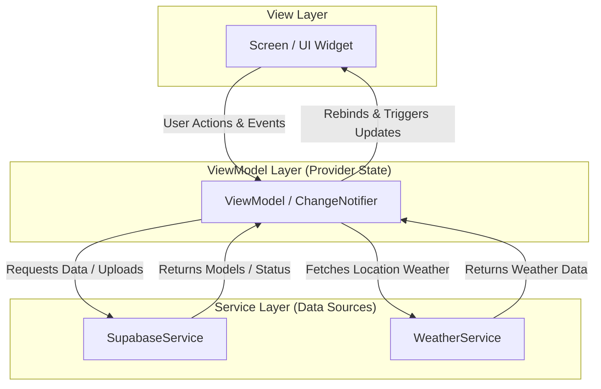

# GlowMatch ✨

[](https://github.com/demmagence/glowmatch)

GlowMatch is a premium, modern, and highly responsive skincare management companion application built with Flutter. It empowers users to establish consistent skincare routines, analyze ingredient safety via OCR text recognition, monitor their monthly skincare budget and product efficiency, and track skin progress visual logs.

---

## 🚀 Key Features

*   **📅 Dynamic Routine Planner**: Manage separate AM and PM skincare routines with step sequences and location-based weather advice (e.g., reminding to use SPF on high UV index days).
*   **🧪 Smart Ingredient Scanner (OCR + AI)**: Scan product ingredient lists using Google ML Kit Text Recognition and analyze safety, skin type suitability, and recommendations via the Gemini API (with local offline fallback).
*   **🧴 Skincare Shelf Management**: Catalog products, brand details, price, and track remaining uses with visual indicators and simple decrement actions.
*   **📊 Cost-Efficiency Budget Tracker**: Monitor monthly skincare expenses grouped by category, and calculate advanced efficiency metrics (cost-per-use) to identify your best-value products.
*   **📸 Visual Progress Journal**: Log daily skin condition scores (0-100) and track progress visually in a premium gallery layout backed by Supabase Storage.

---

## 🏗️ Architecture

GlowMatch is built using the **MVVM (Model-View-ViewModel)** design pattern coupled with the **Provider** state management library. 

Below is the data flow architecture of GlowMatch:



---

## 🛠️ Tech Stack

| Technology | Purpose | Details / Libraries |
| :--- | :--- | :--- |
| **Flutter** | Cross-platform application framework | Dart SDK >= 3.11.0 |
| **Provider** | State management & dependency injection | `provider: ^6.1.2` |
| **Supabase** | Backend Database, Authentication, & Storage | `supabase_flutter: ^2.5.4` |
| **Google ML Kit** | On-device text recognition (OCR) | `google_mlkit_text_recognition: ^0.12.0` |
| **Gemini API** | Ingredient safety and suitability analysis | `gemini-3.1-flash-lite` |

---

## ⚙️ Setup Instructions

Follow these step-by-step instructions to get a local copy of GlowMatch up and running:

1.  **Clone the repository**:
    ```bash
    git clone https://github.com/demmagence/glowmatch.git
    cd glowmatch
    ```

2.  **Configure Environment Secrets**:
    *   Copy `secrets.example.json` and save it as `secrets.json` in the root of the project:
        ```bash
        cp secrets.example.json secrets.json
        ```
    *   Open `secrets.json` and fill in your actual API keys:
        ```json
        {
          "SUPABASE_URL": "https://your-project-id.supabase.co",
          "SUPABASE_ANON_KEY": "your-supabase-anon-key",
          "GEMINI_API_KEY": "your-gemini-api-key",
          "GEMINI_MODEL": "gemini-3.1-flash-lite"
        }
        ```
    *   *Note: If you leave these values as placeholders, GlowMatch will automatically fall back to an Offline Mock Mode with pre-seeded data.*

3.  **Install dependencies**:
    ```bash
    flutter pub get
    ```

4.  **Run the application**:
    ```bash
    flutter run --dart-define-from-file=secrets.json
    ```

---

## 🗄️ Supabase Setup & Schemas

To run GlowMatch with full cloud syncing, set up a new Supabase project and execute the following SQL scripts to build the tables and enable Row Level Security (RLS).

### 1. Create Tables
Execute this script in your Supabase SQL Editor:

```sql
-- Create Skincare Shelf table
CREATE TABLE public.skincare_shelf (
    id TEXT PRIMARY KEY,
    user_id UUID REFERENCES auth.users(id) ON DELETE CASCADE,
    name TEXT NOT NULL,
    brand TEXT,
    category TEXT DEFAULT 'Other',
    price NUMERIC(10, 2) DEFAULT 0.0,
    estimated_uses INT DEFAULT 50,
    remaining_uses INT DEFAULT 50,
    indicator_color TEXT DEFAULT '0xFFE040FB',
    image_url TEXT,
    ingredients TEXT[] DEFAULT '{}',
    created_at TIMESTAMPTZ DEFAULT NOW()
);

-- Create Routines table
CREATE TABLE public.routines (
    id TEXT PRIMARY KEY,
    user_id UUID REFERENCES auth.users(id) ON DELETE CASCADE,
    routine_type TEXT NOT NULL, -- 'AM' or 'PM'
    step_number INT NOT NULL,
    name TEXT NOT NULL,
    description TEXT,
    shelf_item_id TEXT REFERENCES public.skincare_shelf(id) ON DELETE SET NULL
);

-- Create Journal Entries table
CREATE TABLE public.journal_entries (
    id TEXT PRIMARY KEY,
    user_id UUID REFERENCES auth.users(id) ON DELETE CASCADE,
    logged_date TEXT NOT NULL,
    skin_score INT DEFAULT 80,
    photo_path TEXT,
    notes TEXT,
    created_at TIMESTAMPTZ DEFAULT NOW()
);
```

### 2. Enable Row Level Security (RLS)
Ensure users can only access their own records:

```sql
-- Enable RLS
ALTER TABLE public.skincare_shelf ENABLE ROW LEVEL SECURITY;
ALTER TABLE public.routines ENABLE ROW LEVEL SECURITY;
ALTER TABLE public.journal_entries ENABLE ROW LEVEL SECURITY;

-- Create Policies (Example for Skincare Shelf)
CREATE POLICY "Users can manage their own shelf items" 
ON public.skincare_shelf 
FOR ALL 
TO authenticated 
USING (auth.uid() = user_id);

-- Create Policies for Routines
CREATE POLICY "Users can manage their own routines" 
ON public.routines 
FOR ALL 
TO authenticated 
USING (auth.uid() = user_id);

-- Create Policies for Journal Entries
CREATE POLICY "Users can manage their own journal entries" 
ON public.journal_entries 
FOR ALL 
TO authenticated 
USING (auth.uid() = user_id);
```

### 3. Create Storage Bucket
Create a new public storage bucket named `journal-photos` to allow visual progress logs to upload successfully. Add a bucket policy permitting authenticated users to upload and view items.
