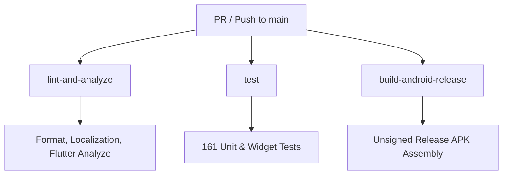

# GlowMatch CI Pipeline Documentation

This document explains the Continuous Integration (CI) workflow configured for the GlowMatch repository in `.github/workflows/ci.yml`.

---

## 1. Workflow Architecture

The CI pipeline runs automatically on:
- All pull requests targeting `main`
- All direct pushes to `main`

The pipeline is split into three modular, parallelized jobs:



### 1.1 Job: `lint-and-analyze`
- **Job Name in GitHub:** `Lint, Format, and Static Analysis`
- **Purpose:** Ensures code hygiene, deterministic code style, valid localization generation, and zero static analysis issues.
- **Commands Run:**
  ```bash
  flutter pub get
  dart format --output=none --set-exit-if-changed lib test integration_test
  flutter gen-l10n
  git diff --exit-code lib/l10n/
  flutter analyze --fatal-infos --fatal-warnings
  ```

### 1.2 Job: `test`
- **Job Name in GitHub:** `Unit and Widget Tests`
- **Purpose:** Executes the full unit and widget test suite with silent error handling for platform fallbacks.
- **Commands Run:**
  ```bash
  flutter pub get
  flutter test
  ```

### 1.3 Job: `build-android-release`
- **Job Name in GitHub:** `Non-Secret Android Release Compilation`
- **Purpose:** Verifies that release bytecode, Kotlin compilation, and ProGuard / R8 rules compile successfully without requiring signing credentials stored in Git.
- **Commands Run:**
  ```bash
  flutter pub get
  flutter build apk --release
  ```

---

## 2. Recommended Branch Protection Rules

To protect the `main` branch, configure GitHub repository settings (**Settings > Branches > Branch protection rules > `main`**) with the following required status checks:

1. `Lint, Format, and Static Analysis`
2. `Unit and Widget Tests`
3. `Non-Secret Android Release Compilation`

Additionally, enable:
- **Require a pull request before merging**
- **Require status checks to pass before merging**
- **Require branches to be up to date before merging**

---

## 3. Maintenance & Local Pre-Flight Check

Before opening a pull request, run the following commands locally:

```bash
# 1. Format code
dart format lib test integration_test

# 2. Verify localization
flutter gen-l10n

# 3. Static analysis
flutter analyze --fatal-infos --fatal-warnings

# 4. Run test suite
flutter test

# 5. Verify release compilation
flutter build apk --release
```

### 3.1 Caching Strategy
The workflow utilizes `subosito/flutter-action@v2` with `cache: true`. The action manages cache isolation internally by runner operating system, Flutter channel, Flutter version, architecture, and lockfile hash (`flutter-:os:-:channel:-:version:-:arch:-:hash:`). This ensures cached SDK and pub dependencies never cross incompatible Flutter environments or corrupt the runner build cache.
