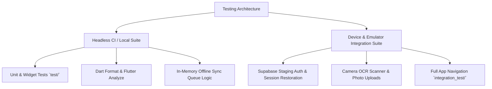

# GlowMatch Integration Test Matrix & Execution Guide

This document defines the platform testing matrix, device coverage, environment separation, and execution strategies for GlowMatch.

---

## 1. Test Architecture & Environment Separation

GlowMatch enforces a strict separation between **Headless CI Tests** and **Device-Dependent Integration Tests**:



### 1.1 Headless CI Suite (`test/`)
- **Execution Target:** GitHub Actions Linux runners (`ubuntu-latest`) and local developer machines.
- **Requirements:** No physical device or running emulator required.
- **Coverage:** ViewModels, services, business logic, widget rendering, local SQLite cache fallbacks, mock weather, and format validation.
- **Run Command:**
  ```bash
  flutter test
  ```

### 1.2 Device & Emulator Suite (`integration_test/`)
- **Execution Target:** Connected Android devices / emulators and iOS devices / simulators.
- **Requirements:** Running Android emulator (API 26–34) or iOS simulator (iOS 14–18), or physical test devices.
- **Coverage:** Full app launch, splash-to-auth navigation, guest login, bottom tab switching, shelf CRUD, routine completion, journal logging, camera capture, and offline-to-online network reconnection.
- **Run Command:**
  ```bash
  flutter test integration_test/app_flow_test.dart -d <device_id>
  flutter test integration_test/auth_flow_test.dart -d <device_id>
  flutter test integration_test/core_features_test.dart -d <device_id>
  ```

---

## 2. Platform & OS Support Matrix

| Platform | Minimum Supported Version | Target / Tested Version | Emulator / Device Configuration |
| :--- | :--- | :--- | :--- |
| **Android** | Android 8.0 (API 26) | Android 14 (API 34) | Pixel 7 / Pixel 8 AVD, x86_64, Google APIs |
| **iOS** | iOS 13.0 | iOS 17.x / 18.x | iPhone 15 / iPhone 16 Simulator |

### Key Hardware Feature Separation

| Feature | Headless CI Handling | Real Device / Emulator Handling |
| :--- | :--- | :--- |
| **Camera & OCR** | Mocked in ViewModel unit tests (`ScannerViewModel`) | Live camera stream or virtual scene emulator image capture |
| **Photo Uploads** | Mocked `SupabaseService` storage in-memory | Real staging Supabase storage bucket (`product-photos`, `journal-photos`) |
| **Geolocation** | Fallback to default location without plugin exception | Simulated GPS coordinates in emulator location settings |
| **Push Notifications** | Timezone resolution unit tests | Scheduled local notification trigger verification |

---

## 3. Staging Backend Data Isolation

To prevent test runs from polluting production or conflicting with one another:

1. **Disposable Credentials**:
   Integration tests targeting real backend behavior use staging Supabase credentials injected via `--dart-define-from-file=secrets.staging.json`:
   ```bash
   flutter test integration_test/auth_flow_test.dart --dart-define-from-file=secrets.staging.json -d emulator-5554
   ```

2. **Data Namespacing & Cleanup**:
   - All test users must follow the naming pattern: `e2e_test_<uuid>@example.com`.
   - All test shelf items, routines, and journal entries are prefixed with `e2e_`.
   - Test suites clean up created rows during `tearDownAll()` using the user ID or delete endpoints.
   - Tests never read or modify rows outside their scoped disposable user.
