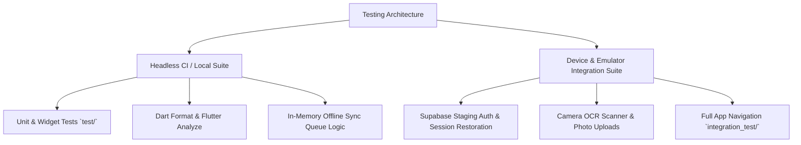

# GlowMatch Integration Test Matrix & Execution Guide

This document defines the platform testing matrix, device coverage, environment separation, and execution strategies for GlowMatch.

---

## 1. Test Architecture & Environment Separation

GlowMatch enforces a strict separation between **Headless CI Tests** and **Device-Dependent Integration Tests**:



### 1.1 Headless CI Suite (`test/`)
- **Execution Target:** GitHub Actions Linux runners (`ubuntu-latest`) and local developer machines.
- **Requirements:** No physical device or running emulator required.
- **Coverage:** ViewModels, services, business logic, widget rendering, local SQLite cache fallbacks, mock weather, and format validation.
- **Run Command:**
  ```bash
  flutter test
  ```

### 1.2 Device & Emulator Suite (`integration_test/`)
- **Execution Target:** Connected Android devices / emulators and iOS devices / simulators.
- **Requirements:** Running Android emulator (API 26–34) or iOS simulator (iOS 14–18), or physical test devices.
- **Coverage:** Full app launch, splash-to-auth navigation, guest login, bottom tab switching, shelf CRUD, routine completion, journal logging, camera capture, offline-to-online network reconnection, and real Supabase staging backend CRUD/sync.
- **Test Suites:**
  - `integration_test/app_flow_test.dart`: Complete end-to-end app navigation and bottom tab switching.
  - `integration_test/auth_flow_test.dart`: Authentication lifecycle, onboarding skip, guest entry, and screen transitions.
  - `integration_test/core_features_test.dart`: Shelf inventory, routine completion, journal logging, and offline sync queue.
  - `integration_test/staging_authenticated_flow_test.dart`: Real authenticated Supabase staging backend execution (signup/signin, table CRUD, offline-to-online sync, and teardown).
- **Run Commands:**
  ```bash
  # Run mock / local device flows
  flutter test integration_test/app_flow_test.dart -d <device_id>
  flutter test integration_test/auth_flow_test.dart -d <device_id>
  flutter test integration_test/core_features_test.dart -d <device_id>

  # Run real authenticated Supabase staging suite (requires non-committed secrets)
  flutter test integration_test/staging_authenticated_flow_test.dart -d <device_id> --dart-define-from-file=secrets.json
  ```

---

## 2. Platform & OS Support Matrix

| Platform | Minimum Supported Version | Target / Tested Version | Emulator / Device Configuration |
| :--- | :--- | :--- | :--- |
| **Android** | Android 8.0 (API 26) | Android 14 (API 34) | Pixel 7 / Pixel 8 AVD, x86_64, Google APIs |
| **iOS** | iOS 13.0 | iOS 17.x / 18.x | iPhone 15 / iPhone 16 Simulator |

### Key Hardware Feature Separation

| Feature | Headless CI Handling | Real Device / Emulator Handling |
| :--- | :--- | :--- |
| **Camera & OCR** | Mocked in ViewModel unit tests (`ScannerViewModel`) | Live camera stream or virtual scene emulator image capture |
| **Photo Uploads** | Mocked `SupabaseService` storage in-memory | Real staging Supabase storage bucket (`product-photos`, `journal-photos`) |
| **Geolocation** | Fallback to default location without plugin exception | Simulated GPS coordinates in emulator location settings |
| **Push Notifications** | Timezone resolution unit tests | Scheduled local notification trigger verification |

---

## 3. Staging Backend Configuration & Secrets Loading

Real backend integration tests use `StagingConfig` (`integration_test/staging_config.dart`) to safely resolve secrets without committing them to source control:

### 3.1 Secret Resolution Priority
1. **Compile-time flags**: `--dart-define=SUPABASE_TEST_URL=...` or `--dart-define-from-file=secrets.json`
2. **Process environment variables**: `SUPABASE_TEST_URL` & `SUPABASE_TEST_ANON_KEY` (or `SUPABASE_URL` & `SUPABASE_ANON_KEY`)
3. **Local git-ignored file**: `secrets.json` at the repository root

### 3.2 Clear Failure Mode
When executing `staging_authenticated_flow_test.dart`, `StagingConfig.loadOrThrow()` strictly validates that credentials are non-empty and not placeholder values (`YOUR_URL`, `YOUR_KEY`). If absent, the suite immediately fails with a descriptive `TestFailure` detailing how to configure test secrets.

### 3.3 Disposable Test Data & Automated Teardown
To isolate test runs from each other and prevent database clutter:
- **Disposable User Identities**: `e2e_runner_<timestamp>@glowmatch.local`
- **Disposable Records**: All test rows in `skincare_shelf` use IDs prefixed with `e2e_shelf_<timestamp>`
- **Teardown Lifecycle**: In `tearDownAll` and `try ... finally` blocks:
  - Created records are deleted from remote Supabase tables (`client.from('skincare_shelf').delete().eq('id', itemId)`)
  - Local database caches are flushed via `DatabaseHelper().clearAllTables()`
  - Active Supabase auth sessions are terminated via `client.auth.signOut()`
- **Optional Staging Credentials**: If the staging Supabase project enforces email confirmation or signup rate limits, supply `SUPABASE_TEST_EMAIL` and `SUPABASE_TEST_PASSWORD` in `secrets.json` or CI secrets to run tests using a pre-confirmed staging test user.
